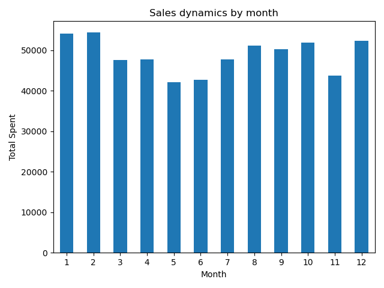
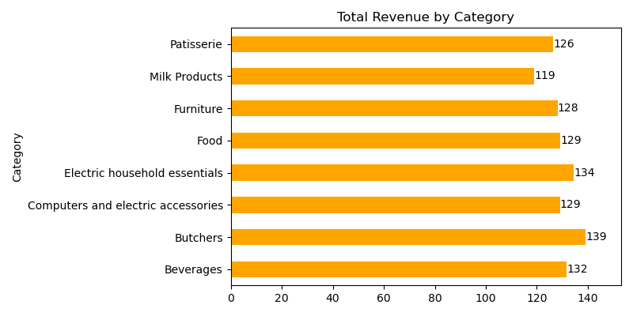
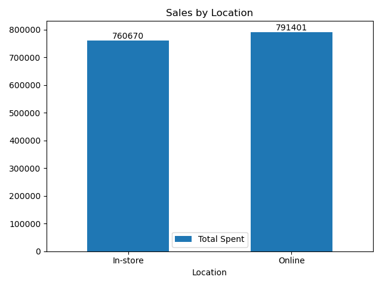
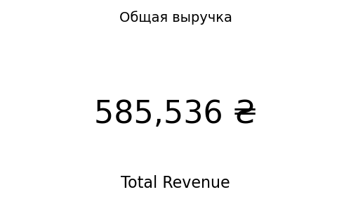
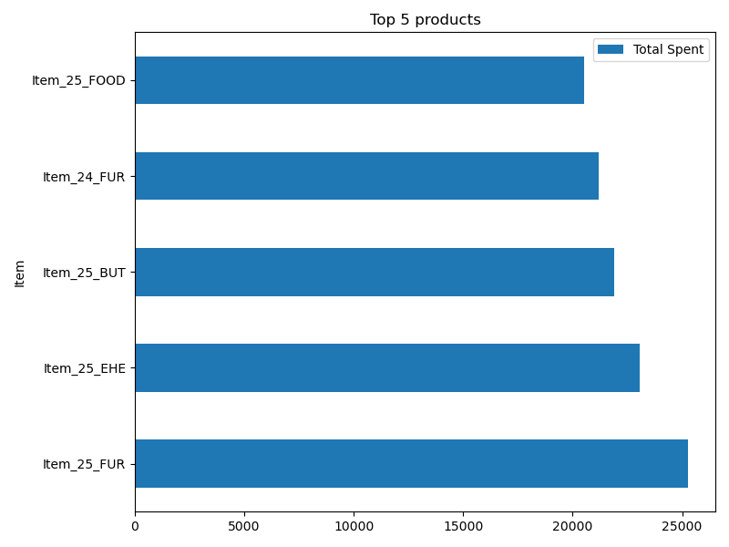

# 🧼 Retail Sales Cleaning and Analysis

This project demonstrates how to clean and analyze dirty retail sales data using Python, with a focus on practical business insights and clean project structure.  
It simulates the real-world workflow of a data analyst: from importing raw data to delivering insights through charts and commentary.

---

## 📦 Dataset

- 📁 `data/retail_store_sales_dirty.csv`  
- Rows: `12,575`, Fields: `11`  
- Contains: product info, pricing, discounts, locations, transaction dates

---

## 🛠️ Technologies Used

- **Python (pandas, matplotlib)**
- Jupyter Notebook
- Data visualization & basic EDA

---

## 🧹 Project Workflow

1. **Import and inspect** the dataset
2. **Remove critically incomplete rows** ('Quantity', 'Price', 'Total Spent')
3. **Clean formatting** (whitespaces, lowercase, date/time, currency strings)
4. **Normalize values** (capitals, title case)
5. **Drop duplicates**
6. **Analyze & visualize** using charts and summary tables

---

## 📊 Visuals and Business Insights

### 📈 Monthly Sales Trend  
- **Peak sales** in January and December — likely holiday-driven  
- **Drop** in months 5–7 suggests a seasonal low

---

### 🧾 Average Receipt by Category  
- **Highest avg. receipts**: Butchers, Beverages, Electric Essentials  
- **Lowest avg. receipts**: Milk Products, Patisserie

---

### 🛍️ Sales by Location  
- **Online slightly leads**: 791,401 ₴ vs. In-store 760,670 ₴  
- Balanced channel strategy recommended

---

### 💰 Total Revenue  
- **Total Revenue**: **₴585,536**  
- Serves as a baseline KPI

---

### 🏆 Top 5 Products by Revenue

- Item_25_FUR leads in sales  
- Likely high-margin or high-demand items

---

## 📌 Summary Highlights

| Metric                            | Value                                 |
|----------------------------------|---------------------------------------|
| **Total Revenue**                | ₴585,536                              |
| **Transactions with Discounts**  | 8376 out of 12575 (~66.6%)          |
| **Calculation Deviations**       | 1213 records |
---

## 📁 Project Structure

retail_sales_cleaning/
├── data/
│ └── retail_store_sales_dirty.csv
├── visuals/
│ ├── avg_receipt.png
│ ├── monthly_sales_trend.png
│ ├── sales_by_location.png
│ ├── top_5_products.png
│ └── total_revenue.png
├── retail_sales_cleaning.ipynb
└── README.md

---

## ✅ What This Project Demonstrates

- Realistic **data cleaning** workflow
- Effective **project folder organization**
- Insightful **visualization with commentary**
- Ability to **communicate findings** to business stakeholders

---

## ✍️ Author

Made by [Your Name] — aspiring Data Analyst  
Connect on [LinkedIn] or explore other projects on [GitHub].